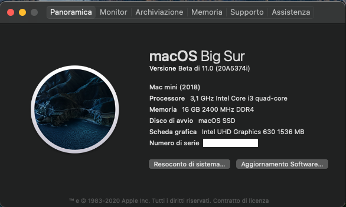

# INTEL NUC10i5FNH Hackintosh

EFI for Intel NUC10i5FNH with OpenCore bootloader

### Computer Spec:

| Component        | Brank                              |
| ---------------- | ---------------------------------- |
| CPU              | Intel i5 10210U                    |
| iGPU             | Intel® UHD Graphics                |
| Lan              | Intel I219V10                      |
| Audio            | Realtek ALC256                     |
| Ram              | 32 Gb DDR4 2666 Mhz                |
| Wifi + Bluetooth | INTEL Wi-Fi 6 AX201                |
| NVMe             | SAMSUNG 970 EVO PLUS 250 GB (MACOS)|
| SSD              | SILICON POWER 1 TB (WINDOWS)       |
| SmBios           | MacMini 8,1                        |
| BootLoader       | OpenCore                           |

## Peripherals

### What works and What doesn't or WIP:

- [x] Intel UHD 630 iGPU HDMI Output
- [x] ALC256 Internal Speakers
- [x] ALC256 Native Combojack headphones
- [x] ALC256 HDMI Audio Output
- [x] All USB Ports 
- [x] SpeedStep / Sleep / Wake
- [x] Wi-Fi and Bluetooth
- [x] Intel LAN
- [x] THUNDERBOLT 3
- [x] NVRAM
- [x] ALC256 Combojack microphone
- [x] ALC256 jack LINE-IN

### Special Config:

- Usb port mapping performed

### SSDT Info

See [ioreg](./ioregmacbook.ioreg) for more clarification

## Credits

- [Apple](https://apple.com) for macOS;
- [Acidanthera](https://github.com/acidanthera) for OpenCore and all the lovely hackintosh work.
- [Dortania](https://github.com/dortania)
- [Hackintoshlifeit](https://github.com/Hackintoshlifeit)

# If you need help please contact us on [Telegram](https://t.me/HackintoshLife_it) or [Web](https://www.hackintoshlife.it/)
