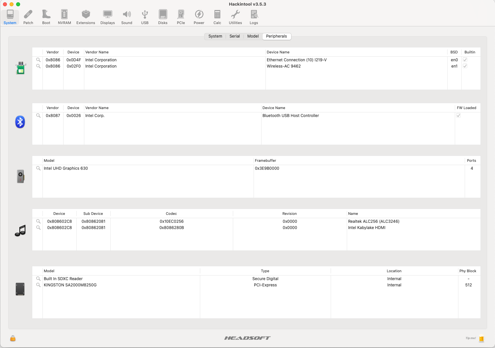
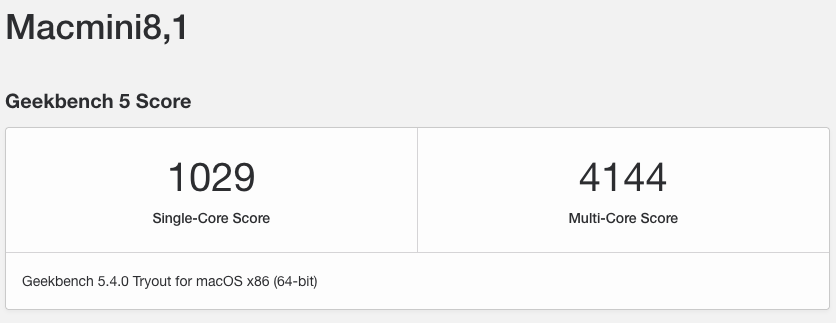
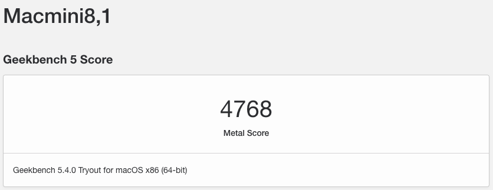
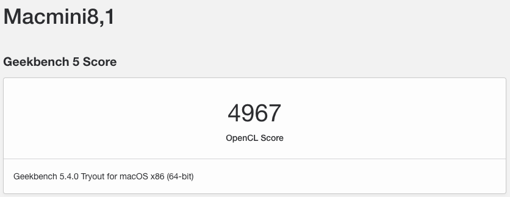
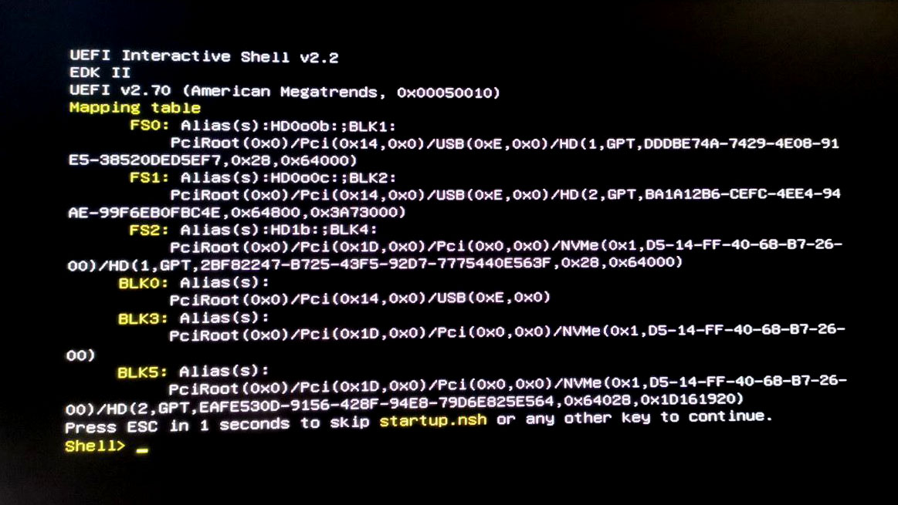
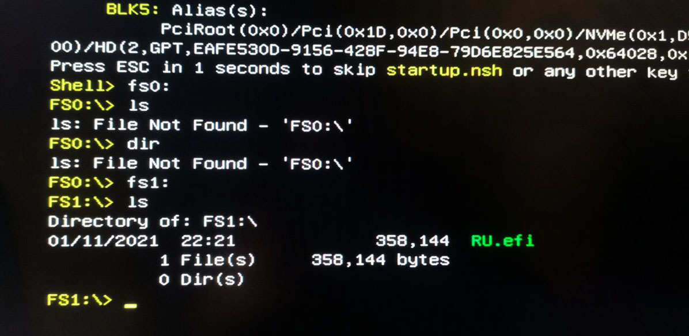
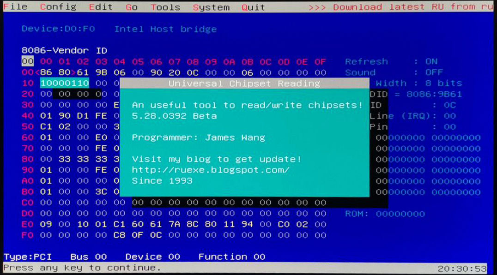
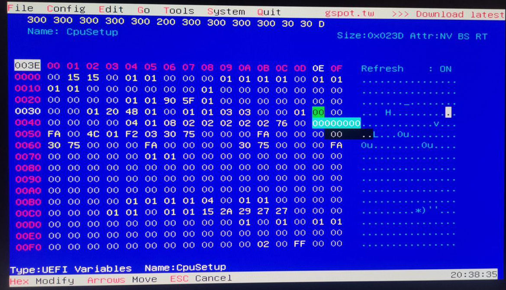

  

# 6 APRIL 2021 ADDED NEW EFI. I'LL UPDATE THE REPO WITH THE NEW INFOS IN FEW DAYS

# INTEL NUC10i5FNH Hackintosh

EFI for Intel NUC10i5FNH with OpenCore bootloader

### Computer Spec:

| Component        | Brank                              |
| ---------------- | ---------------------------------- |
| CPU              | Intel i5 10210U                    |
| iGPU             | Intel® UHD Graphics                |
| Lan              | Intel I219V10                      |
| Audio            | Realtek ALC256                     |
| Ram              | 32 Gb DDR4 2666 Mhz                |
| Wifi + Bluetooth | INTEL Wi-Fi 6 AX201                |
| NVMe             | SAMSUNG 970 EVO PLUS 250 GB (MACOS)|
| SSD              | SAMSUNG 860 EVO 1TB (WINDOWS)      |
| SmBios           | MacMini 8,1                        |
| BootLoader       | OpenCore                           |

## Peripherals & Benchmarks

### What works and What doesn't or WIP:

- [x] Intel UHD iGPU HDMI Output / USB C Output Video
- [x] ALC256 Native Combojack headphones
- [x] ALC256 HDMI Audio Output (*note)
- [x] All USB Ports
- [x] SpeedStep / Sleep / Wake
- [x] Wi-Fi and Bluetooth
- [x] Intel LAN
- [x] Thunderbolt 3
- [x] NVRAM
- [x] ALC256 Combojack microphone
- [x] ALC256 jack LINE-IN

## CFG Unlock 

N.B. this procedure is very risky.
Any responsibility for this function is discharged to those who perform it.
Be very careful when making this change.

Let's start by downloading the file [RU.efi](./CFGunlock/RU.efi)

We format the USB in FAT32 format.
We copy the RU.efi file in the USB Root.
We enable the UEFI Shell parameter from the BIOS.
We attach the USB stick to the PC and start the UEFI Shell by pressing F10.

If everything is correct, we will come to this screen:

We will then have to find our ROOT, which in my case is FS1
So now we will write "fs1:"
Then we will write "ls"

We will find ourselves in this situation at this point:

Then type RU.efi and this mask will appear.

Press ALT + ì to remove the popup on the screen.
At this point, on the keyboard, press PagDOWN to scroll the list.

We need to get to the "CPUSetup"

And click ENTER to access the section.

Now we have to go down to the value "0030 - 0E

Now let's change the value 01 to 00

The correct version will be the following:

Now to save we press CTRL + W

If everything went well, we will have this screen with a red popup

Ejoy

# BIOS
## WIP

### Special Config:

See [ioreg](./MacMini.ioreg) for more clarification

## Credits

- [Apple](https://apple.com) for macOS;
- [Acidanthera](https://github.com/acidanthera) for OpenCore and all the lovely hackintosh work.
- [Dortania](https://github.com/dortania)
- [VoodooHDA](https://sourceforge.net/p/voodoohda/code/HEAD/tree)
- [Hackintoshlifeit](https://github.com/Hackintoshlifeit)
- [PIERPAOLO](https://github.com/pierpaolodimarzo) for his desire to learn and the great commitment he has put into this project

# If you need help please contact us on [Telegram](https://t.me/HackintoshLife_it) or [Web](https://www.hackintoshlife.it/)
